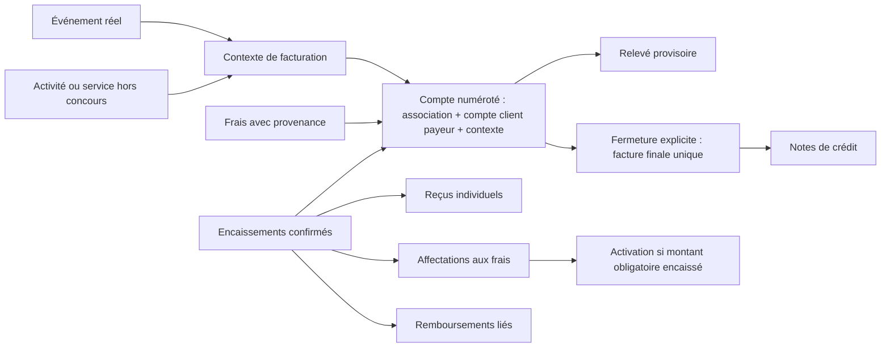

# Modèle révisé et livraison — D1 à D5 validées

6 septembre 2026. Base : `origin/preprod` à `6ca720b`.
Branche dédiée : `feat/billing-folio-foundation`.
Ce document remplace les propositions initiales de l'audit. Il constitue la
présentation demandée **avant les migrations**; ce n'est pas une description de
fonctionnalités déjà implémentées. Voir le [contrat de tranche](premiere-tranche.md)
et la [matrice des tests](tests-acceptation.md).

## Décisions acquises

| Décision | Invariant |
| --- | --- |
| D1 | Un compte courant par association, compte client payeur stable, contexte, même après fermeture; devise unique imposée par le contexte. Jamais un second compte pour contourner un compte fermé. |
| D2 | Le paiement produit un reçu et laisse le compte ouvert. La fermeture explicite produit une seule facture finale immuable. |
| D3 | Personnel autorisé de l'association, ou agent actif pour une dépense admissible du propriétaire relative au cheval mandaté. Vérification serveur à l'instant de l'opération. |
| D4 | Un service exigeant un paiement est confirmé uniquement après encaissement du montant obligatoire pour ce service. Une préautorisation ne suffit pas. |
| D5 | Plusieurs encaissements et moyens par compte, avec affectations aux frais pour déterminer les services activables. |

Le payeur est un **compte client payeur stable de l'association**, identifié par
`billing_customer_accounts.id`, avec ou sans connexion HSP. Il référence le contact
métier; il n'est ni `auth.uid()` ni un profil de connexion. Ses liens de connexion
peuvent évoluer sans changer le propriétaire des écritures financières. Sa vue globale
regroupe ses comptes de concours ou hors concours et documents; ce n'est pas une facture.

## Terminologie et trois numéros distincts

| Libellé FR obligatoire | Libellé EN proposé | Usage |
| --- | --- | --- |
| Compte du concours | Show account | Compte courant complet du payeur pour l'événement. |
| No de compte du concours | Show account number | Référence publique créée dès la première opération acceptée. |
| Relevé du compte | Account statement | Document provisoire : frais, paiements et solde à la date du relevé. |
| Reçu de paiement | Payment receipt | Preuve propre à chaque encaissement individuel. |
| Facture finale | Final invoice | Document unique et immuable à la fermeture. |
| Compte hors concours | Non-show account | Catégorie administrative générale, sans événement fictif; le client voit le nom précis du type de compte. |

Le terme `folio` reste technique (`billing_folios`); « dossier du show »,
« réservation » et « folio » ne sont pas les appellations principales de l'interface.
Le mot « campagne » ne doit apparaître dans aucun libellé destiné aux utilisateurs.
Dans le contexte de l'en-tête, le libellé court **No de compte** est permis.

Exemple validé de présentation :

> **Compte du concours — AQR Futurité 2027**
>
> **No de compte : AQR-2027-00482**
>
> **Statut : Ouvert**
>
> **Solde actuel : 425,00 $**

Le format illustré n'impose pas encore une règle de séquence officielle. Proposition
technique : numéro public immuable unique par association, tous contextes et états
confondus; série configurée avant ouverture, compteur serveur atomique, aucun
`MAX + 1` non verrouillé, aucun recyclage. Un changement de nom du concours ou de
contact ne le modifie pas. Les recherches administratives sont limitées aux
associations autorisées; connaître un numéro public ne donne aucun accès.

Conserver séparément : UUID technique du compte, **numéro public du compte**,
**numéro de reçu** pour chaque paiement, **numéro de facture** seulement à la
fermeture. Séries/identifiants typés distincts, aucune conversion du numéro de
compte en numéro de facture. Relevés, reçus, facture finale et crédits liés
conservent le numéro public du compte; il est indexé pour les recherches et exporté
avec chaque référence documentaire pertinente.

Le compte est créé dans la transaction de la première opération acceptée, même
si cette opération ne produit pas encore un frais ou un encaissement (p. ex. une
inscription gratuite ou une réservation en attente). Deux premières opérations
simultanées partagent le même compte et le même numéro. L'échec de l'opération
ne laisse pas de compte orphelin; les éventuels trous de séquence ne justifient
jamais de réutiliser un numéro déjà publié.

Un compte peut contenir plusieurs chevaux. Chaque propriétaire réellement payeur
a son compte; si l'entraîneur paie réellement toutes les dépenses, son compte peut
les regrouper, sous réserve de l'autorisation applicable à chaque opération.
L'auteur ou le cheval ne fait pas partie de la clé de regroupement. La relation
cheval/compte ne donne pas à un agent accès aux autres chevaux ou aux paiements
personnels du même payeur.

## Frais à payeur unique et devise du contexte

Chaque frais appartient à un seul compte et à un seul compte client payeur.
Il conserve son bénéficiaire, son cheval éventuel, sa source et son auteur.
Pour plusieurs clients, la secrétaire crée des frais ou éléments de réservation
distincts. Aucun tableau de parts, pourcentage ni algorithme de division/arrondi
entre payeurs n'est prévu. Les affectations répartissent uniquement **un paiement
sur les frais du même compte**; elles ne répartissent pas une dépense entre comptes.
Les anciennes répartitions restent historiques et ne sont ni effacées ni reproduites
comme exigence du nouveau moteur.

Chaque concours/contexte hors concours possède une seule devise configurée à
l'avance. Le navigateur l'affiche en lecture seule et ne la choisit pas. Les RPC
la résolvent côté serveur; une devise contradictoire fournie par une intégration
ou un paiement est refusée, sans conversion. Compte, frais, taxes, paiements,
reçus et facture utilisent cette même devise. Les clés étrangères et validations
SQL propagent cet invariant à toutes les écritures, même hors interface.
Une association peut utiliser une autre devise dans **un autre contexte**.
Prévoir les clés candidates composites référencées `(organization_id,id,currency)`
sur les parents concernés; une FK composite ne peut pas référencer une combinaison
non unique. La clé métier du compte reste sans devise.

La devise du contexte est immuable après la première opération financière, même
si le solde est zéro. Avant toute ouverture, une correction de configuration reste
réservée au personnel habilité et auditée. L'ancienne devise de présentation de
l'association n'est pas relue pour recalculer un compte ou un document existant.

## Contact payeur, entreprise et instantanés

Le contact existant reste l'identité du payeur. `billing_customer_accounts` est
son ancrage financier stable, UNIQUE `(organization_id,payer_contact_id)`;
une entreprise facultative ne crée pas un second payeur ni une personne morale
financière séparée. Le compte de connexion HSP reste indépendant.

Ajouter au contact le champ nullable proposé `company_name`, libellé **Nom de
l'entreprise** / **Company name**. Le type `Contact` actuel dans
`src/types/domain.ts` possède `barn_name` et les coordonnées, mais aucun champ
`company_name`/`business_name` n'a été trouvé dans le code ou les migrations.
Ne pas réutiliser le nom d'écurie comme nom d'entreprise ni migrer l'un dans l'autre.
Prévoir l'extension des types d'entrée, services et formulaire de contact, sans
modifier les UUID ou les liens existants; les anciennes valeurs restent NULL.

Sans entreprise, afficher le nom du contact. Avec entreprise, conserver son nom
**et** celui de l'entreprise. Chaque relevé produit, reçu et facture finale fige
le nom du contact, l'entreprise facultative, l'adresse de facturation, les
coordonnées nécessaires et les numéros fiscaux configurés pertinents, distincts
pour vendeur et payeur. Ne pas inventer les informations fiscales manquantes.
L'instantané inclut date, auteur/version et références du compte/document.

La vue courante du compte peut évoluer; chaque **Relevé du compte** produit est
un instantané daté conservé. Un nouveau relevé a une nouvelle identité/version;
retélécharger un ancien relevé ne relit pas les coordonnées actuelles. La même
règle vaut pour reçus et facture finale. Les futurs documents peuvent utiliser
les coordonnées corrigées sans réécrire aucune pièce antérieure.

## Frontière opérationnelle et comptabilité générale

HSP est un système opérationnel de gestion des comptes clients, frais, factures
et encaissements, inspiré du fonctionnement d'un PMS hôtelier. HSP n'est pas un
logiciel de comptabilité générale et ne cherche pas à remplacer Xero, QuickBooks
ou Sage.

HSP explique qui paie, pour quel cheval/bénéficiaire et service, dans quel contexte,
les frais et taxes facturés, les paiements reçus, les services confirmables, le
solde et les documents produits. Il transmet ensuite les données structurées et
références stables aux logiciels comptables. Les mappings de revenus/taxes et le
journal opérationnel servent cet export; ils ne constituent pas un grand livre.
Le grand livre général, la paie, les dépenses fournisseurs, les rapprochements
bancaires complets et les états financiers restent hors périmètre. Le rapprochement
d'un paiement HSP avec sa référence fournisseur ne promet pas un rapprochement
bancaire général.

## Types de comptes hors concours

L'administration classe ces comptes sous **Compte hors concours**. Le client voit
le nom public précis du type et, lorsqu'elle est pertinente, la période du contexte :

| Type technique indicatif | Nom présenté au client | EN proposé |
| --- | --- | --- |
| `membership` | Compte d'adhésion — 2027 | Membership account — 2027 |
| `nomination` | Compte de nomination — Poulains 2027 | Nomination account — Foals 2027 |
| `shop` | Compte boutique | Shop account |
| `clinic` | Compte de clinique — Mars 2027 | Clinic account — March 2027 |
| `rental` | Compte de location | Rental account |
| `services` | Compte de services | Services account |

Autre exemple validé :

> **Compte de nomination — Futurité 2027**
>
> **No de compte : NOM-2027-00142**
>
> **Statut : Ouvert**
>
> **Solde : 250,00 $**

Séparer le **type** configurable (p. ex. nomination), le **contexte** concret
(p. ex. Futurité 2027) et le **compte du payeur**. Deux activités de même type et de
même année peuvent être distinctes; ni le nom public, ni le type, ni l'année seule
ne remplace l'identifiant du contexte dans la contrainte d'unicité.

Chaque type définit le nom public localisé, le préfixe, la règle de période/année,
les catégories de frais permises, les règles de paiement et d'activation, les dates
ou valeurs par défaut d'ouverture/fermeture et les permissions. Le contexte porte
les valeurs effectives datées et la version de configuration; une année n'est pas
obligatoire pour une boutique permanente. Les adaptations par contexte doivent être
explicitement autorisées et auditées. Une nouvelle activité utilise le même moteur
de frais, taxes, paiements, reçus et facture finale, sans nouvelle table financière.

Le serveur valide catégories, calendrier, droits et règles d'activation à chaque
opération. Une configuration de type ne peut pas élargir les droits d'un agent
au-delà de son mandat ni confirmer un service sans les fonds exigés encaissés.
La fermeture des nouvelles opérations à une date donnée ne finalise pas
implicitement tous les comptes et n'empêche pas l'encaissement d'une dette existante.
La facture reste émise par fermeture explicite; aucune fermeture automatique
financière n'est activée par la seule présence d'une date de fin.

La numérotation résout le préfixe du type et la période du contexte à l'ouverture.
Un changement ultérieur de préfixe, de libellé ou de période ne renumérote aucun
compte existant. Les collisions entre types/préfixes restent protégées par l'unicité
publique à l'échelle de l'association; aucun compteur concurrent isolé par type
ne peut publier le même numéro. Les pièces figent leur libellé et leur référence
lors de l'émission; les modifications de configuration ne réécrivent pas l'historique.

## Tables et contraintes proposées

Les noms ci-dessous sont un contrat de conception, pas des tables déjà créées.
Utiliser UUID et clés étrangères composites incluant l'association pour interdire
les liens inter-associations. Les écritures financières n'ont pas de suppression
en cascade depuis contacts, chevaux, événements ou profils.

| Table | Contenu et garantie |
| --- | --- |
| `billing_context_types` | Catalogue extensible par association : code stable UNIQUE `(organization_id,code)`, nom public FR/EN, préfixe de numérotation, politique de période/année, catégories de frais admises, règles de paiement/activation, valeurs d'ouverture/fermeture et permissions applicables. Types sous forme de données, pas un enum SQL par activité. Versions de configuration conservées; extension sans nouvelles tables financières. |
| `billing_contexts` | Association, `kind=event/non_event`, show réel OU `context_type_id` et code d'activité stable, nom public résolu, période/année, dates/fuseau, version de politique, état `draft/active/archived`, moteur `legacy/folio`. CHECK exclusif : event ⇒ show non NULL et type hors concours absent; non_event ⇒ show NULL, type et code obligatoires. UNIQUE partiel `(organization_id,show_id)` pour event; UNIQUE partiel `(organization_id,context_code)` pour non_event. Devise unique `currency` obligatoire, configurée avant activation, figée dès la première opération financière; FK du show/type dans la même association. Renommer l'activité ne change pas son identité. |
| `billing_customer_accounts` | UUID stable, association, contact payeur existant, état actif/archivé; UNIQUE `(organization_id,payer_contact_id)` pour éviter deux comptes clients pour un même payeur. Identité financière conservée après changement/suppression du login; FK historiques restrictives. Fusion de contacts = opération explicite de rapprochement, jamais réattribution silencieuse. |
| `billing_folios` | Association, contexte, `payer_customer_account_id`, devise héritée du contexte et figée, `public_number`, état `open/closed`, version, dates/auteurs. UNIQUE **non partiel** `(organization_id,billing_context_id,payer_customer_account_id)` et UNIQUE `(organization_id,public_number)`; numéro non NULL, immuable et non réutilisable. FK compte client/contexte dans la même association; FK composite `(organization_id,billing_context_id,currency)` garantissant la devise du contexte. |
| `billing_folio_horses` | Association, compte, cheval, source du rattachement, auteur/date; UNIQUE `(folio_id,horse_id)`. Plusieurs chevaux par compte; un cheval peut avoir des opérations de payeurs différents si justifiées. Les frais restent rattachés à leur cheval/bénéficiaire/source propres. |
| `billing_number_sequences` | Séries distinctes compte/reçu/facture, association, portée configurée et compteur atomique. Numéro de compte à l'ouverture, reçu à l'encaissement, facture à la fermeture. Aucun numéro officiel de facture réservé au simple paiement. |
| `billing_charges` | Un seul compte et donc un seul compte client payeur par frais; type, produit/catégorie comptable, description figée, quantité, prix, remise, base/taxes/total, acteur, bénéficiaire, cheval éventuel, autorisation utilisée, instant serveur. Ajustements liés plutôt que suppression d'un frais encaissé. |
| `billing_source_links` | Source système/type/UUID, composante, version métier et frais. UNIQUE `(organization_id,source_system,source_type,source_id,component,source_version)`. Une inscription peut avoir inscription/pénalité/juge, chacune une seule fois. Une version suivante crée un ajustement et ne recopie pas intégralement le montant. |
| `billing_tax_rules` | Code, nom, juridiction, taux décimal, version, dates d'effet, règle d'assiette et d'arrondi, référence justificative. Versions utilisées non modifiables. |
| `billing_tax_profiles`, `billing_product_tax_rules` | Association/article/catégorie, taxes applicables et exemption motivée. Configuration manquante ≠ taux zéro. Résolution serveur à la date fiscale retenue. |
| `billing_charge_taxes` | Par frais et taxe : règle/version, nom, code, juridiction, taux, base et montant arrondi figés. UNIQUE `(charge_id,tax_rule_id)`; conserver aussi la raison d'exemption. |
| `billing_payments` | Compte, montant réellement reçu, devise identique, moyen, référence, date de réception et de saisie, auteur, tiers versant éventuel et preuve. Première tranche : comptant ou Interac confirmé seulement. |
| `billing_payment_allocations` | Paiement, frais et montant positif. UNIQUE `(payment_id,charge_id)`, même compte obligatoire. Sommes plafonnées au paiement net et au frais restant à couvrir sous verrou serveur; un simple CHECK ne peut garantir ces sommes concurrentes. |
| `billing_service_requirements` | Source du service, frais liés, montant obligatoire, politique/version; `awaiting_payment/eligible/activated/cancelled`. Activation sur affectations nettes réellement encaissées, pas sur solde global. |
| `billing_statements` | Relevés provisoires produits, UUID/version/date, compte, devise, instantané contact/entreprise/coordonnées et lignes/paiements/solde. Conservation append-only; nouveau relevé = nouvelle pièce, sans numéro de facture. |
| `billing_receipts` | Paiement UNIQUE, numéro de reçu, instantané montant/devise/moyen/référence/dates/auteur/payeur/affectations, document conservé. Paiement et reçu logique atomiques. Numérotation distincte des factures; FK compte et numéro public du compte figé dans le reçu. |
| `billing_final_invoices` | `folio_id UNIQUE`, numéro officiel unique dans la portée configurée, instantané vendeur/payeur/contexte/devise/lignes/taxes/total, auteur/date/version de rendu et numéro public du compte figé. INSERT une fois, UPDATE/DELETE du document refusés. |
| `billing_credit_notes`, `billing_refunds` | Documents et opérations distincts, liés aux lignes/taxes et paiements d'origine, motif/auteur, plafonds contrôlés sous verrou. Pas de réécriture de facture ni de double diminution du solde. |
| Extension future `billing_debit_notes` | Note de débit ou document complémentaire lié par FK à la facture finale et à son compte, avec numéro propre, lignes/taxes/instantané/auteur/motif et idempotence. Ne constitue pas une deuxième facture finale; aucune réouverture. Aucun schéma exécutable ni interface à implémenter dans la première tranche. |
| `billing_authorizations` | Mandat du propriétaire à l'agent, association, cheval, propriétaire payeur, catégories permises, début/fin, révocation, auteur et preuve. Historique conservé. |
| `billing_operations` | Association, acteur, clé idempotente, opération, contenu normalisé/empreinte et réponse durable. UNIQUE `(organization_id,actor_profile_id,idempotency_key)` tous types d'opérations confondus; même clé avec contenu différent ⇒ conflit. |
| `billing_audit_events`, `billing_outbox` | Journal append-only et travaux après commit, clés d'événement uniques. Rendu documentaire/activation relançables sans réencaisser ni réémettre. |
| `billing_legacy_links`, `accounting_export_batches/items` | Correspondances historiques sans remplacement des anciennes clés; exports versionnés, identifiants stables, empreintes, destination, statut et référence d'import. |

La facture nouvelle est distincte des anciennes `invoices`. L'interface présente
les deux sources avec leur identité d'origine; elle ne crée pas une facture legacy
miroir pour chaque nouveau document. Le solde courant est une projection séparée
de l'instantané officiel, qui reste inchangé après encaissement ultérieur.

## États, soldes et transactions

La contrainte non partielle garantit notamment **un seul compte actif**, et reste
plus forte après fermeture pour respecter D1/D2 : pas de deuxième compte ni de
seconde facture finale dans la même portée. Le mot « actif » n'introduit donc pas
un index partiel qui autoriserait de rouvrir un nouveau compte après clôture.
L'unicité du contexte événement/hors concours ramène exactement la clé à :
association + contexte (concours ou activité hors concours) + compte client payeur.
La devise ne permet jamais de créer un second compte dans cette portée.

`open → closed` est irréversible pour le contenu. Un compte soldé peut recevoir
plus tard des frais tant qu'il reste ouvert. Le statut de règlement est calculé
`unpaid/partial/settled/credit`, indépendamment de l'état du compte.
Après fermeture, encaissements de la dette et corrections documentaires restent
possibles; aucun frais ordinaire supplémentaire ni réouverture. La fermeture initiale est
manuelle après confirmation d’un récapitulatif versionné. Les frais tardifs
exceptionnels sont exclus de la première tranche; une future note de débit liée
pourra augmenter la créance sans rouvrir le compte ni réécrire la facture finale.

Propositions de périmètre de la première tranche, distinctes de D1–D5 : fermeture
avec solde dû autorisée après confirmation explicite du montant restant; aucun
paiement fictif. Encaissement supérieur au solde refusé pour cette tranche; avances
non affectées/avoirs entre comptes à livrer ensuite. Fermeture automatique
**désactivée** : politique `manual`, aucun job créé par défaut.

Convention : `solde = frais TTC + ajustements + notes de débit émises − notes de crédit − encaissements
confirmés + remboursements confirmés`. Les affectations ne soustraient pas une
seconde fois le paiement. La future note de débit augmente la créance une seule fois, sans modifier le total
de la facture originale. Première tranche sans ces corrections : frais TTC moins
encaissements confirmés. Les totaux sont calculés côté serveur en décimal.

Arrondi proposé : chaque taxe de ligne à l'unité mineure, puis somme des lignes;
quantité × prix moins remise constitue l'assiette. Première tranche limitée aux
devises à deux décimales explicitement configurées et aux taxes indépendantes
prises en charge. Configuration complexe/non supportée ⇒ refus expliqué, aucune
approximation silencieuse. Les taux de test sont fictifs, aucun barème légal n'est
inventé ou chargé depuis l'ancien taux global.

Chaque mutation est une RPC transactionnelle :

1. Résoudre l'acteur depuis `auth.uid()`, vérifier association, contexte, payeur,
   bénéficiaire et permission actuelle. Ne pas accepter l'auteur fourni par le client.
2. Verrouiller la permission/mandat utilisé contre une révocation concurrente.
   L'instant de contrôle sérialisé est le point d'autorisation de l'opération.
3. Prendre les verrous dans l'ordre commun : contexte/moteur, clé idempotente,
   compte, frais/services triés par UUID, séquence documentaire si nécessaire.
4. Une répétition identique restitue la réponse durable après vérification des
   droits actuels; contenu différent ⇒ conflit, aucun effet secondaire.
5. Résoudre le compte client stable, puis le compte du concours ou hors concours par
   `INSERT … ON CONFLICT` et `SELECT … FOR UPDATE`. Attribuer son numéro public
   uniquement lors de la création effective, dans cette transaction.
   Deux secrétaires avec deux ventes légitimes obtiennent un compte et deux frais.
6. Calculer et écrire frais/paiement/affectations/document logique/journal/résultat
   dans une transaction unique. Échec ⇒ rollback intégral.
7. Après commit, rendre le document et traiter l'outbox. Un échec PDF ne rejoue
   jamais la commande financière et ne change pas le numéro.

Tous les writers, anciens compris durant la transition, doivent prendre le même
verrou de portée. Verrouiller le nouveau moteur seul ne protège pas de l'ancien.
La référence bancaire Interac unique est aussi protégée par association/moyen,
avec normalisation documentée; deux clés HTTP ne permettent pas de saisir deux
fois le même virement. Pour du comptant, deux remises réellement distinctes de
même montant/date sont possibles : clé stable contre double clic et consultation
des reçus récents, sans promettre une déduplication impossible entre saisies indépendantes.

## Autorisations

Première tranche : personnel d'association admin/secrétaire; secrétaire de show
limitée à ce show, compte hors concours réservé au personnel habilité de l'association selon le type.
Le rôle plateforme existant est conservé explicitement et audité. La lecture du
client ne donne aucun droit d'écriture. `can_access_contact` ne suffit pas à débiter.

L'agent est refusé sur la vente générale, même s'il accède au cheval. Son futur
parcours est une commande métier typée : cheval mandaté, propriétaire payeur et
catégorie admise, mandat actif au moment du contrôle serveur. Pas d'adhésion,
marchandise générale, dépense personnelle ou autre cheval sans mandat distinct.
`horse_contacts.role='agent'` et ses booléens actuels n'ont pas les dates ni la
preuve nécessaires : ne pas les interpréter comme une délégation financière illimitée.

Chaque opération conserve séparément l'auteur résolu côté serveur, le bénéficiaire,
le cheval concerné, le compte client payeur stable et la preuve d'autorisation.
Un paiement est lié au compte; ses affectations identifient les frais/services
couverts sans inventer un cheval pour une vente générale.

RLS de lecture par personnel/payeur lié. La recherche par numéro et le téléchargement
des relevés/reçus/factures appliquent les mêmes règles que la consultation du compte.
L'accès agent à une opération du cheval ne donne pas accès au relevé financier
complet du propriétaire. Vérifier côté serveur l'association du compte client,
le mandat et le payeur réellement autorisé, sans les déduire du login auteur. Pas d'écriture directe client sur les
tables financières; fonctions avec `search_path` fixé, EXECUTE restreint et
contrôles internes. Protéger aussi les imports/service-role et l'immuabilité SQL,
pas seulement désactiver un bouton. Les preuves d'autorisation sont conservées
même après révocation/suppression du compte de connexion.

## Compatibilité : risques précis et remplacement

| Existant | Risque | Changement requis |
| --- | --- | --- |
| `sync_stall_booking_invoice`, `0043_short_invoice_numbers.sql` | Dernier draft sans unicité payeur, nouveau draft après émission, déplacement de lignes existantes | Compte/source uniques, verrou commun et transaction inventaire/éléments distincts par payeur/frais, sans ventilation automatique. |
| `sync_entry_invoice` et `recalculate_entry_judge_fees`, `20260801000200_blocks_classes_core_rebuild.sql` | Même course au draft; juge supprimé/reconstruit; anciennes lignes déplacées | Composantes stables, ajustements avant clôture, corrections documentaires après. |
| `sync_manual_sale_invoice`, `0067_internal_memberships.sql` | Retry INSERT = nouveau UUID/nouvelle ligne; annulation modifie une facture émise | RPC idempotente, un seul writer, aucune double insertion ancienne vente + nouveau frais. |
| `sync_contact_organization_membership_invoice`, même migration | Achats NULL show confondus; activation indépendante des fonds encaissés | Contexte hors concours typé et explicite, frais et politique d'activation. |
| `purchase_incentive_program_nomination`, `20260806000200_incentive_program_age_pricing.sql` | Crée déjà une manual_sale; un second writer nomination doublerait la charge | Une identité/adaptation source; préserver et distinguer les imports historiques. |
| `sync_incentive_nomination_invoice_status`, `20260806000100_incentive_nomination_programs.sql` | Activation sur `paid` de toute la facture | Exigence/affectation propre au service, aucun effet d'un simple statut forcé. |
| `StallsViews.tsx`, `createEntry` | Plusieurs appels; retry panier après succès partiel recrée des éléments | Éléments distincts à payeur unique et idempotents, inventaire consommé une fois; aucun moteur de division automatique à conserver. |
| `payments`, `recalculate_invoice_totals`, `0006_stall_booking_invoices.sql` | Paiement sans mise à jour de total_paid; réparation manuelle puis recalcul peut compter deux fois | Registre de référence, projection calculée, écarts anciens à rapprocher sans paiement fictif. |
| Branche Stripe `a2a6b44` | Capture partielle comptée au montant initial; webhook non atomique | Même registre, clés événement ET capture fournisseur, montant réellement reçu uniquement. Ne pas fusionner en l'état. |
| `BillingView.tsx` | PDF depuis coordonnées/taxes actuelles | Relevé provisoire distinct, rendu du reçu/final depuis instantané. |
| `0044_block_reservations_with_open_invoice_balance.sql` | Ne voit que les anciens invoices et inclut leurs drafts | Lecture unifiée de dette sans compter à la fois compte et document; politique de crédit encore à définir. |

Les constats B01/B02 ont été reproduits dans les diagnostics de l’audit initial; les
autres risques ci-dessus sont issus du code, pas d'un audit de données PROD.

## Bascule et conservation

**Pas d'activation source par source dans un même contexte avec deux moteurs.**
Le pilote utilise des contextes neufs activés explicitement. Dans un contexte
adopté, tout ancien writer doit être raccordé ou refuser l'opération financière
avec une erreur explicite. Ailleurs, le moteur legacy reste entier. Un drapeau
frontend ou l'absence de bouton ne suffit pas.

L'activation prend le verrou de portée, vérifie l'historique et commute le routage
atomiquement. Un contexte avec factures existantes ne peut pas être adopté
silencieusement. Hors événement, `show_id=NULL` ne permet pas de déduire le type ni le contexte hors concours;
les sources doivent être classées explicitement avant reprise, avec type, activité,
période et politique vérifiés. Aucun classement déduit du seul contact payeur.

Les anciennes factures multiples ne sont pas fusionnées, renumérotées ou supprimées
pour rendre D1 artificiellement vrai. Préserver tous les UUID, numéros, paiements,
lignes, liens métier, documents et fichiers. D1 gouverne le nouveau moteur;
les exceptions historiques sont inventoriées et rapprochées avant adoption.
Un montant fiscal sans détail prouvable reste `historical_aggregate_unknown` avec
son montant d'origine. Ne pas reconstruire TPS/TVQ depuis la configuration actuelle.
Un total_paid sans paiement source est une anomalie, pas la preuve d'un encaissement.

La reprise crée des comptes clients stables depuis les liens contact/association
vérifiés, sans changer les UUID des contacts ni les anciens payeurs. Un rattachement
ambigu, un doublon de contacts, plusieurs devises dans une même portée ou une
devise historique non prouvée bloque la reprise
automatique de la portée concernée. Les nouvelles références de compte de reprise
sont identifiées comme attribuées à la migration; elles ne deviennent jamais de
prétendus numéros historiques. Les anciens numéros de facture/reçu restent intacts.
Aucun fichier historique n'est réécrit pour y insérer rétrospectivement un numéro
de compte : correspondance consultable séparément. Les nouveaux reçus/documents
portent leur numéro de compte dès leur création.

Avant bascule : copie privée, inventaire en lecture seule, décomptes/empreintes et
sommes avant/après, liens et fichiers contrôlés, retour arrière répété. Les soldes
d'ouverture exigent une provenance vérifiée. Le rollback arrête les écritures
nouvelles et conserve les documents déjà émis; un rollback frontend seul ne suffit
pas. Aucune migration distante ni promotion n'est autorisée par ce plan.

## Découpage de livraison

| Lot | Sortie vérifiable |
| --- | --- |
| 0 — Présentation | Modèle révisé, impacts, contrats et matrice de tests; D1–D5 acquises; aucune migration à ce stade. |
| 1A — Serveur local | Schéma additif, compte client stable, types hors concours configurables, contexte/compte numéroté, vente/taxes, paiements/affectations/reçus, fermeture unique, permissions et routage exclusif; SQL et concurrence sur base jetable. |
| 1B — Parcours secrétaire | FR/EN avec libellés validés, recherche par numéro, événement/hors concours, vente détaillée, comptant/Interac partiels, reçu, solde, finalisation; tests services/navigateur, deux sessions. |
| 1C — Revue | Aperçu/captures ordinateur/mobile, résultats reproductibles et migration non appliquée à distance. Toute la tranche du contrat fonctionne ensemble. |
| 2 — Métiers et corrections | Inscriptions, réservations, warm-ups, adhésions, nominations, mandats actifs, activation des services, crédits/remboursements. Pas de pilote de show complet avant ce lot. |
| 3 — Stripe Sandbox | Reprise sélective de la branche, captures/webhooks/remboursements/rapprochement testés. Aucun live implicite. |
| 4 — Exports | Journal prévu au socle; adaptateurs Xero/QuickBooks/Sage avec éditions confirmées et imports réels rapprochés. |
| 5 — Promotion | Répétition de migration, sauvegarde/restauration, validation secrétaire puis approbation distincte pour migration distante et promotion. |

La première tranche regroupe vente, taxes, paiements et facture en un seul parcours;
ces capacités ne sont pas trois moteurs à livrer successivement.

## Choix encore ouverts sans rouvrir D1–D5

D6 : politique détaillée de crédit/remboursement et report d'avoirs. D7 : portée,
exercice et format de numérotation officielle; configuration obligatoire avant
émission pilote, préfixes fictifs en tests. D8 : dette bloquante et dérogations.
D9 : éditions/pays exacts des logiciels comptables. D10 : client comptoir éventuel;
la tranche initiale exige un contact payeur identifié.

Fermeture automatique future : préciser fuseau, délai après fin réelle, reports,
services/écritures en attente, litiges, mandat robot et notifications avant toute
activation. Le défaut reste manuel. Barèmes fiscaux réels, configurations des
associations et portée du dépôt ShowScore restent à vérifier.

## Portée de cette revue

La navigation et les routes actuelles sont auditées dans le
[plan de tranche interface](premiere-tranche.md#navigation-et-routes--audit-et-cible).
Conserver le menu vertical de l'association, réutiliser le sélecteur et les vues
existantes, puis ajouter le contexte et les onglets du concours sans dupliquer
les écrans. Les comptes hors concours restent dans la section financière existante.
**Attendre l'autorisation explicite après revue : aucune migration ni implémentation
exécutable ne commence avec cette révision documentaire.**
